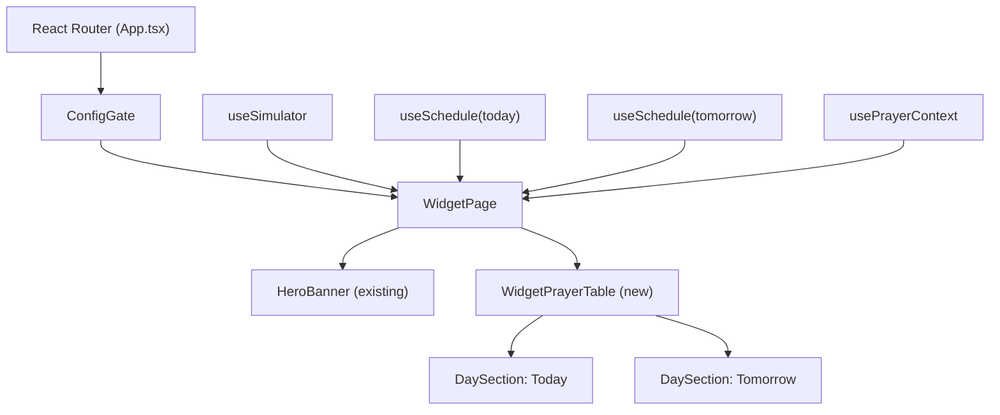

# Design Document: Embeddable Prayer Widget

## Overview

The Embeddable Prayer Widget is a read-only React page served at `/widget` within the existing iqama-ui Vite/React/TypeScript application. It is designed to be embedded in external websites via an `<iframe>` tag. The widget reuses the existing `HeroBanner`, `useSchedule`, and `usePrayerContext` hooks to display a live countdown and a dual-day prayer table (Today + Tomorrow) in a single scrollable view with no interactive elements.

The widget is intentionally minimal: it strips away all interactive chrome (tabs, swipe, footer, sighting card, simulator banner, Eid modal) and replaces the tabbed `PrayerTable` with a new `WidgetPrayerTable` component that stacks both days vertically. Prayer names are shown bilingually (English + Arabic) to serve Arabic-speaking community members.

### Key Design Decisions

- **Reuse over rebuild**: `HeroBanner` and all existing hooks (`useSchedule`, `usePrayerContext`, `useSimulator`) are reused unchanged. Only the prayer table layout is new.
- **New component, not a prop variant**: `WidgetPrayerTable` is a separate component rather than a prop-driven variant of `PrayerTable`. The two components have fundamentally different layouts (vertical stack vs. tabbed/swipeable), and coupling them would add complexity without benefit.
- **No peek interaction**: The widget omits peek state entirely. `HeroBanner` receives no `peekPrayer`/`peekSchedule`/`peekLabel` props, which is valid because those props are optional in the existing interface.
- **Semantic table markup**: `WidgetPrayerTable` uses `<table>` elements for prayer rows to satisfy accessibility requirements and convey tabular structure to screen readers.

---

## Architecture

The widget follows the same data-flow pattern as `PrayerViewerPage`:

```
App.tsx (Router)
  └── ConfigGate
        └── WidgetPage
              ├── HeroBanner          (existing, reused)
              └── WidgetPrayerTable   (new)
                    ├── DaySection (Today)
                    └── DaySection (Tomorrow)
```

Data flows top-down:

```
useSimulator ──► simDateStr, simTomorrowStr
useSchedule(simDateStr) ──► todaySchedule, todayLoading, todayError
useSchedule(simTomorrowStr) ──► tomorrowSchedule
usePrayerContext(today, tomorrow) ──► nextPrayer, countdown, countdownMode, hijriDay, hijriMonth, tick
```

`WidgetPage` owns all state and passes props down. `WidgetPrayerTable` is a pure presentational component with no internal state.

### Mermaid Component Diagram



---

## Components and Interfaces

### `WidgetPage` (`src/pages/WidgetPage.tsx`)

The top-level page component. Mirrors the data-fetching logic of `PrayerViewerPage` but omits all interactive state (peek, sighting, Eid modal, active tab).

```typescript
// No props — page component
export function WidgetPage(): JSX.Element
```

Responsibilities:
- Call `useSimulator` to get `simDateStr`, `simTomorrowStr`, `isSimulating`, `simNow`
- Call `useSchedule(simDateStr)` and `useSchedule(simTomorrowStr)`
- Call `usePrayerContext(todaySchedule, tomorrowSchedule, simNow if simulating)`
- Render `HeroBanner` with context props (no peek props)
- Render loading skeleton when `todayLoading` is true
- Render non-interactive error message when `todayError` is set (no retry button)
- Render `WidgetPrayerTable` when `todaySchedule` is available
- Wrap content in `<main>` landmark

### `WidgetPrayerTable` (`src/components/WidgetPrayerTable.tsx`)

A pure presentational component that renders both days vertically.

```typescript
interface WidgetPrayerTableProps {
  todaySchedule: DailySchedule;
  tomorrowSchedule: DailySchedule | null;
  nextPrayer: PrayerEvent | null;
  countdownMode: CountdownMode;
  tick: number;
}

export function WidgetPrayerTable(props: WidgetPrayerTableProps): JSX.Element
```

Responsibilities:
- Render a `DaySection` for Today (always present when this component renders)
- Render a `DaySection` for Tomorrow, or a loading placeholder if `tomorrowSchedule` is null
- No internal state, no event handlers

### `DaySection` (internal to `WidgetPrayerTable`)

Renders the section header and prayer table for a single day.

```typescript
interface DaySectionProps {
  label: 'Today' | 'Tomorrow';
  labelAr: 'اليوم' | 'الغد';
  schedule: DailySchedule;
  nextPrayer: PrayerEvent | null;
  countdownMode: CountdownMode;
  isToday: boolean;
}
```

Responsibilities:
- Render `<h2>` section header with English label, Arabic label, Hijri date, and formatted Gregorian date
- Render a `<table>` with column headers (Azan/أذان, Iqama/إقامة)
- Render one `<tr>` per prayer (Fajr, Sunrise, Dhuhr, Asr, Maghrib, Isha)
- Highlight the next prayer row when `isToday` and `nextPrayer` matches
- Render "Next Jumuah Prayers" notice at the bottom when `schedule.day_of_week === 'Friday'`

### Route Registration in `App.tsx`

A new `<Route path="/widget" element={<WidgetPage />} />` is added inside the existing `ConfigGate`-wrapped `Routes`. No changes to existing routes.

---

## Data Models

All data models are reused from `src/types/index.ts` without modification.

### Relevant existing types

```typescript
// Prayer times for a single prayer
interface PrayerEntry {
  azan: string;   // HH:mm
  iqama: string;  // HH:mm
}

// One day's full schedule from the API
interface DailySchedule {
  date: string;         // YYYY-MM-DD
  hijri_date: string;   // e.g. "Dhul Hijjah 25, 1446"
  day_of_week: string;  // e.g. "Friday"
  fajr: PrayerEntry;
  sunrise: string;      // HH:mm (no iqama)
  dhuhr: PrayerEntry;
  asr: PrayerEntry;
  maghrib: PrayerEntry;
  isha: PrayerEntry;
  eid_prayer_1?: string;
  eid_prayer_2?: string;
  qiyam_time?: string;
  // ...
}
```

### Bilingual Prayer Label Map (compile-time constant)

```typescript
const BILINGUAL_LABELS: Record<string, { en: string; ar: string }> = {
  fajr:    { en: 'Fajr',    ar: 'فجر'  },
  sunrise: { en: 'Sunrise', ar: 'شروق' },
  dhuhr:   { en: 'Dhuhr',   ar: 'ظهر'  },
  asr:     { en: 'Asr',     ar: 'عصر'  },
  maghrib: { en: 'Maghrib', ar: 'مغرب' },
  isha:    { en: 'Isha',    ar: 'عشاء' },
};
```

### Date Formatting

The Gregorian date is formatted by a pure helper function:

```typescript
function formatWidgetDate(dateStr: string, dayOfWeek: string): string
// Input:  "2025-06-20", "Friday"
// Output: "Friday, Jun 20"
```

This function is the primary target for property-based testing (see Correctness Properties).

---

## Correctness Properties

*A property is a characteristic or behavior that should hold true across all valid executions of a system — essentially, a formal statement about what the system should do. Properties serve as the bridge between human-readable specifications and machine-verifiable correctness guarantees.*

### Property 1: Widget renders no interactive elements

*For any* combination of loading state, loaded schedule data, and error state, the rendered `WidgetPage` output SHALL contain no `<button>`, `<a>`, `<input>`, or other focusable interactive elements.

**Validates: Requirements 2.1, 11.3**

### Property 2: No tab controls or navigation in WidgetPrayerTable

*For any* pair of `DailySchedule` objects (or null for tomorrow), the rendered `WidgetPrayerTable` SHALL contain no tab buttons, swipe handlers, or navigation controls.

**Validates: Requirements 4.2**

### Property 3: Section headers always present for available schedules

*For any* `DailySchedule`, the rendered `DaySection` SHALL always include a heading element (`<h2>` or `<h3>`) above the prayer rows.

**Validates: Requirements 5.1, 12.4**

### Property 4: Hijri date always displayed in section header

*For any* `DailySchedule` with any `hijri_date` string, the rendered section header SHALL contain that exact `hijri_date` string.

**Validates: Requirements 5.4**

### Property 5: Gregorian date formatting is correct for all valid dates

*For any* valid `YYYY-MM-DD` date string and any `day_of_week` string, `formatWidgetDate` SHALL return a string matching the pattern `"{DayOfWeek}, {MonthName} {Day}"` where `MonthName` is the 3-letter English abbreviation and `Day` has no leading zero.

**Validates: Requirements 5.5**

### Property 6: Every prayer row contains both English and Arabic labels

*For any* `DailySchedule`, every rendered prayer row in `WidgetPrayerTable` SHALL contain both the English prayer name and the corresponding Arabic prayer name from the bilingual label map.

**Validates: Requirements 6.1, 6.2**

### Property 7: All prayer times are displayed in the table

*For any* `DailySchedule`, the rendered `WidgetPrayerTable` SHALL contain every `azan` time string from the schedule, and every `iqama` time string for non-sunrise prayers.

**Validates: Requirements 7.1, 7.2, 7.4**

### Property 8: Jumuah notice appears if and only if tomorrow is Friday

*For any* `DailySchedule` passed as the tomorrow schedule, the "Next Jumuah Prayers" notice SHALL appear in the Tomorrow section if and only if `schedule.day_of_week === "Friday"`.

**Validates: Requirements 9.1, 9.2**

### Property 9: Semantic table structure for any schedule

*For any* `DailySchedule`, the rendered `WidgetPrayerTable` SHALL use `<table>`, `<thead>`, `<tbody>`, `<th>`, and `<td>` elements (or equivalent ARIA roles) to convey tabular structure.

**Validates: Requirements 12.2**

---

## Error Handling

### Today's Schedule Load Error

When `useSchedule` returns an error for today's date:
- `WidgetPage` renders a non-interactive `<div role="alert">` with a human-readable error message
- No retry button is rendered (the widget is read-only; the iframe host can reload the page)
- `HeroBanner` still renders with `null` schedule props (sky animation continues)

### Tomorrow's Schedule Load Error

When `useSchedule` returns an error for tomorrow's date:
- `WidgetPrayerTable` renders a static placeholder in the Tomorrow section (e.g., "Tomorrow's times unavailable")
- The Today section is unaffected

### Loading States

- While `todayLoading` is true: a CSS `animate-pulse` skeleton replaces the prayer table (same pattern as `PrayerViewerPage`)
- While tomorrow is loading (`tomorrowSchedule === null`): a "Loading tomorrow…" placeholder appears in the Tomorrow section of `WidgetPrayerTable`

### No Retry Logic

The widget intentionally omits retry buttons. The iframe host is responsible for reloading the page if needed. This keeps the widget fully read-only and avoids interactive elements.

---

## Testing Strategy

### Unit Tests (Vitest + React Testing Library)

Unit tests cover specific examples, edge cases, and structural checks:

- **WidgetPage routing**: Verify `/widget` renders `WidgetPage` (not a redirect)
- **Excluded components**: Verify `PublicFooter`, `OfflineBanner`, `SimulatorBanner`, `SightingCard`, `EidPrayerModal` are absent from the rendered output
- **Loading state**: Verify skeleton is shown when `todayLoading` is true
- **Error state**: Verify error message is shown and no retry button is present
- **Bilingual labels**: Verify each prayer row shows the correct English/Arabic pair
- **Sunrise iqama**: Verify sunrise row has azan time but empty iqama cell
- **Jumuah notice**: Verify notice appears on Friday, absent on other days
- **Accessibility**: Verify `<main>` landmark, `aria-live` on countdown, `lang` attribute
- **`formatWidgetDate`**: Verify specific examples (e.g., "2025-06-20" + "Friday" → "Friday, Jun 20")

### Property-Based Tests (Vitest + fast-check)

The project already includes `fast-check` as a dev dependency. Each property test runs a minimum of 100 iterations.

**Tag format**: `// Feature: embeddable-prayer-widget, Property {N}: {property_text}`

#### Property 1 Test: No interactive elements in any widget state

Generate arbitrary combinations of:
- `todaySchedule`: arbitrary `DailySchedule` or null (loading)
- `tomorrowSchedule`: arbitrary `DailySchedule` or null
- `error`: arbitrary error string or null

Assert: rendered output contains no `button`, `a[href]`, `input`, `select`, or `textarea` elements.

#### Property 2 Test: No tab controls in WidgetPrayerTable

Generate arbitrary pairs of `DailySchedule` objects. Assert: rendered `WidgetPrayerTable` contains no `role="tab"`, `role="tablist"`, or elements with `aria-pressed`.

#### Property 3 Test: Section headers always present

Generate arbitrary `DailySchedule`. Assert: rendered `DaySection` contains an `h2` or `h3` element.

#### Property 4 Test: Hijri date in header

Generate arbitrary `DailySchedule` with arbitrary `hijri_date` string. Assert: rendered header contains the `hijri_date` string.

#### Property 5 Test: `formatWidgetDate` output format

Generate arbitrary valid `YYYY-MM-DD` date strings (month 1–12, day 1–28 for safety) and arbitrary `day_of_week` strings. Assert: output matches `/^[A-Za-z]+, [A-Za-z]+ \d{1,2}$/`.

#### Property 6 Test: Bilingual labels in every row

Generate arbitrary `DailySchedule`. Assert: for each of the 6 prayers (fajr, sunrise, dhuhr, asr, maghrib, isha), the rendered row contains both the English and Arabic label from `BILINGUAL_LABELS`.

#### Property 7 Test: All prayer times displayed

Generate arbitrary `DailySchedule` with arbitrary HH:mm time strings. Assert: every `azan` time and every non-sunrise `iqama` time appears in the rendered output.

#### Property 8 Test: Jumuah notice iff Friday

Generate arbitrary `DailySchedule`. Assert: "Next Jumuah Prayers" text is present if and only if `day_of_week === "Friday"`.

#### Property 9 Test: Semantic table structure

Generate arbitrary `DailySchedule`. Assert: rendered output contains `table`, `thead`, `tbody`, `th`, and `td` elements.

### Integration Tests

- **API wiring**: Verify `useSchedule` is called with the correct date strings derived from `useSimulator`
- **usePrayerContext wiring**: Verify `HeroBanner` receives props derived from `usePrayerContext` output

### Accessibility Checks

- Verify `<main>` landmark is present
- Verify countdown has `aria-live="polite"` and `aria-atomic="true"` (preserved from existing `HeroBanner`)
- Verify section headers are `<h2>` or `<h3>` elements
- Verify prayer table uses semantic `<table>` markup
