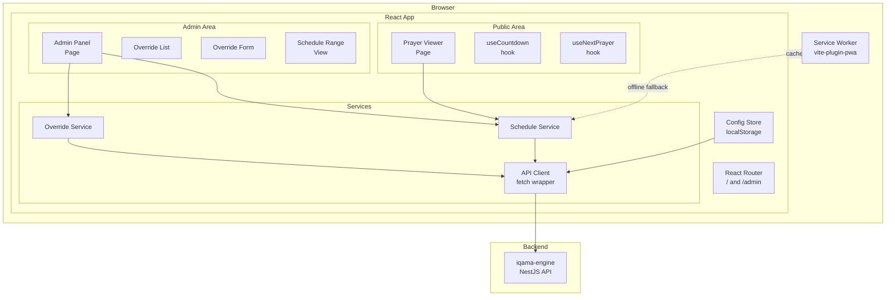

# Design Document — prayer-app (iqama-ui)

## Overview

**iqama-ui** is a mobile-first Progressive Web Application (PWA) built with React 19, TypeScript 6, Vite, Vitest, and TailwindCSS. It serves two audiences:

- **Congregation members** — view today's and tomorrow's prayer times, see the next upcoming prayer highlighted, and watch a live countdown to the next azan/iqama.
- **The Imam (admin)** — manage iqama time overrides (create, edit, delete) and view a multi-day schedule range to make informed decisions.

The app communicates exclusively with the existing `iqama-engine` NestJS backend. All configuration (API base URL, API key) is stored in `localStorage` and never hard-coded.

### Key Design Principles

- **Offline-capable shell**: A Vite PWA service worker caches the app shell so the UI loads without a network connection.
- **No data caching**: Every API request goes directly to the server — no in-memory or localStorage schedule caching. This ensures the Imam and congregation always see the latest data.
- **No global state library**: React Context + `useReducer` is sufficient for this app's scope; no Redux/Zustand.
- **API-key auth is client-side only**: The API key is stored in `localStorage` and sent as an `x-api-key` header. There is no server-side session.
- **Separation of concerns**: Data-fetching logic lives in service modules (plain TypeScript classes/functions), UI logic lives in React components and hooks.

---

## Architecture



### Routing

| Path | Component | Auth Required |
|---|---|---|
| `/` | `PrayerViewerPage` | No |
| `/admin` | `AdminPage` | API key (client-side) |
| `/admin/schedule` | `ScheduleRangePage` | API key (client-side) |

A top-level `ConfigGate` component checks whether the API base URL is set; if not, it renders a `ConfigSetupScreen` before any other content.

An `AdminAuthGate` component wraps all `/admin` routes and checks whether an API key is stored; if not, it renders an `ApiKeyEntryScreen`.

---

## Components and Interfaces

### Component Tree

```
App
├── ConfigGate
│   ├── ConfigSetupScreen          (shown when baseUrl is missing)
│   └── Router
│       ├── PrayerViewerPage       (route: /)
│       │   ├── DayTabBar          (today / tomorrow tabs)
│       │   ├── PrayerTable        (prayer rows)
│       │   │   └── PrayerRow      (one row per prayer)
│       │   ├── NextPrayerBanner   (highlighted next prayer + countdown)
│       │   └── OfflineBanner      (shown when serving cached data)
│       └── AdminAuthGate
│           ├── ApiKeyEntryScreen  (shown when no API key stored)
│           └── AdminLayout
│               ├── AdminNav       (tab bar: Overrides / Schedule)
│               ├── OverridesPage  (route: /admin)
│               │   ├── OverrideList
│               │   │   └── OverrideRow  (with edit/delete actions)
│               │   └── OverrideFormModal
│               └── ScheduleRangePage  (route: /admin/schedule)
│                   ├── DateRangePicker
│                   └── ScheduleRangeTable
│                       └── ScheduleRangeRow
```

### Key Component Interfaces

```typescript
// PrayerViewerPage
interface PrayerViewerPageProps {} // no props, reads from services

// PrayerTable
interface PrayerTableProps {
  schedule: DailySchedule;
  nextPrayer: PrayerName | null;
  isToday: boolean;
}

// PrayerRow
interface PrayerRowProps {
  name: PrayerName;
  entry: PrayerEntry | { azan: string; iqama?: never }; // sunrise has no iqama
  isNext: boolean;
}

// NextPrayerBanner
interface NextPrayerBannerProps {
  nextPrayer: PrayerName | null;
  countdown: CountdownState;
}

// OverrideRow
interface OverrideRowProps {
  override: Override;
  isActive: boolean; // today falls within startDate–endDate
  onEdit: (override: Override) => void;
  onDelete: (id: number) => void;
}

// OverrideFormModal
interface OverrideFormModalProps {
  initial?: Override;           // undefined = create mode
  onSave: (data: OverridePayload) => Promise<void>;
  onClose: () => void;
}

// ScheduleRangeRow
interface ScheduleRangeRowProps {
  schedule: DailySchedule;
  overrides: Override[];        // overrides active on this day
  onCellTap: (date: string, prayer: PrayerName) => void;
}
```

### Custom Hooks

| Hook | Purpose |
|---|---|
| `useSchedule(date: string)` | Fetches a single day's schedule from the API |
| `useScheduleRange(start: string, end: string)` | Fetches a range of schedules from the API |
| `useOverrides()` | Fetches all overrides, exposes CRUD actions |
| `useNextPrayer(schedule: DailySchedule \| null)` | Derives the next prayer name from current time |
| `useCountdown(schedule: DailySchedule \| null, nextPrayer: PrayerName \| null)` | Computes countdown string, ticks every 10 s |
| `useConfig()` | Reads/writes Config_Store values |
| `useOnlineStatus()` | Tracks `navigator.onLine` |

### Service Layer

```typescript
// api-client.ts — thin fetch wrapper
async function apiFetch<T>(
  path: string,
  options?: RequestInit & { requiresAuth?: boolean }
): Promise<T>

// schedule-service.ts
async function fetchScheduleForDate(date: string): Promise<DailySchedule>
async function fetchScheduleForRange(start: string, end: string): Promise<DailySchedule[]>

// override-service.ts
async function fetchOverrides(): Promise<Override[]>
async function createOverride(payload: OverridePayload): Promise<Override>
async function updateOverride(id: number, payload: Partial<OverridePayload>): Promise<Override>
async function deleteOverride(id: number): Promise<void>
```

---

## Data Models

### Shared Types (mirroring the backend)

```typescript
export type PrayerName = 'fajr' | 'dhuhr' | 'asr' | 'maghrib' | 'isha';

export interface PrayerEntry {
  azan: string;   // HH:mm
  iqama: string;  // HH:mm
}

export interface DailySchedule {
  date: string;         // YYYY-MM-DD
  hijri_date: string;   // e.g. "Dhul Hijjah 25, 1446"
  day_of_week: string;  // e.g. "Friday"
  is_dst: boolean;
  fajr: PrayerEntry;
  sunrise: string;      // HH:mm
  dhuhr: PrayerEntry;
  asr: PrayerEntry;
  maghrib: PrayerEntry;
  isha: PrayerEntry;
  metadata: {
    calculation_method: 'ISNA';
    has_overrides: boolean;
  };
}

export interface Override {
  id: number;
  prayer: PrayerName;
  overrideType: 'FIXED' | 'OFFSET';
  value: string;      // HH:mm for FIXED, signed integer string for OFFSET
  startDate: string;  // YYYY-MM-DD
  endDate: string;    // YYYY-MM-DD
}

// Payload used when creating or updating an override (id excluded)
export type OverridePayload = Omit<Override, 'id'>;
```

### Config Store Shape

```typescript
// Stored in localStorage
interface AppConfig {
  baseUrl: string;   // e.g. "https://api.example.com"
  apiKey: string;    // empty string when not authenticated
}

const CONFIG_KEYS = {
  BASE_URL: 'iqama_ui_base_url',
  API_KEY:  'iqama_ui_api_key',
} as const;
```

### Countdown State

```typescript
type CountdownPhase = 'to_azan' | 'to_iqama' | 'done';

interface CountdownState {
  phase: CountdownPhase;
  display: string;   // e.g. "14:32" or "All prayers complete"
}
```

### Next Prayer Derivation Logic

The `useNextPrayer` hook iterates over the ordered prayer list `['fajr', 'dhuhr', 'asr', 'maghrib', 'isha']` and returns the first prayer whose azan time (parsed as `HH:mm` on today's date) is strictly after the current local time. If all azan times have passed, it returns `null`.

```typescript
function deriveNextPrayer(
  schedule: DailySchedule,
  now: Date
): PrayerName | null
```

### Countdown Derivation Logic

Given the next prayer and the current time:

1. If `now < azan time` → phase is `to_azan`, display remaining time.
2. If `azan time ≤ now < iqama time` → phase is `to_iqama`, display remaining time.
3. If `now ≥ iqama time` → advance to next prayer (re-derive). If no next prayer, phase is `done`.

```typescript
function deriveCountdown(
  schedule: DailySchedule,
  nextPrayer: PrayerName,
  now: Date
): CountdownState
```

---

## Correctness Properties

*A property is a characteristic or behavior that should hold true across all valid executions of a system — essentially, a formal statement about what the system should do. Properties serve as the bridge between human-readable specifications and machine-verifiable correctness guarantees.*

### Property 1: Next prayer is always in the future (or null)

*For any* valid `DailySchedule` and any current time `now`, the prayer returned by `deriveNextPrayer(schedule, now)` SHALL have an azan time strictly after `now`. If all azan times have passed, the function SHALL return `null`.

**Validates: Requirements 4.1, 4.3**

---

### Property 2: Countdown phase is consistent with current time

*For any* valid `DailySchedule`, next prayer `p`, and current time `now`, the `CountdownState` returned by `deriveCountdown(schedule, p, now)` SHALL satisfy:
- If `phase === 'to_azan'`, then `now < azan(p)` and `display` matches `MM:SS` or `H:MM:SS`.
- If `phase === 'to_iqama'`, then `azan(p) ≤ now < iqama(p)` and `display` matches `MM:SS` or `H:MM:SS`.
- If `phase === 'done'`, then `now ≥ iqama(p)` and there is no later prayer in the day, and `display` is a non-empty string.

**Validates: Requirements 5.1, 5.3, 5.4, 5.5**

---

### Property 3: Schedule URL construction is correct

*For any* valid base URL and YYYY-MM-DD date string, the URL produced by the schedule service for a single-day request SHALL equal `{baseUrl}/api/v1/schedule?date={date}`. *For any* valid base URL, start date, and end date, the range URL SHALL equal `{baseUrl}/api/v1/schedule?start_date={start}&end_date={end}`.

**Validates: Requirements 2.1, 2.2**

---

### Property 4: Config store round-trip

*For any* valid base URL string and API key string, writing them to the Config_Store and then reading them back SHALL return the same values.

**Validates: Requirements 1.1, 1.2, 1.5**

---

### Property 5: Today's schedule offline cache round-trip

*For any* valid `DailySchedule` object, serializing it to the today-cache (`localStorage`) and deserializing it SHALL produce a structurally equivalent object with all fields preserved.

**Validates: Requirements 6.5**

---

### Property 6: Override active-status classification is correct

*For any* `Override` and any reference date `today` (YYYY-MM-DD string), the boolean `isActive(override, today)` SHALL be `true` if and only if `override.startDate ≤ today ≤ override.endDate`.

**Validates: Requirements 8.3**

---

### Property 7: Admin requests always include the x-api-key header

*For any* stored API key string, every outgoing admin API request (to `/api/v1/admin/*`) SHALL include an HTTP header `x-api-key` whose value equals the stored key.

**Validates: Requirements 7.4**

---

### Property 8: PrayerTable renders all required fields for any schedule

*For any* valid `DailySchedule`, the rendered `PrayerTable` output SHALL contain the Gregorian date, Hijri date, day of week, sunrise time, and the azan and iqama times for all five prayers (Fajr, Dhuhr, Asr, Maghrib, Isha).

**Validates: Requirements 3.2**

---

### Property 9: Exactly one prayer row is highlighted as next

*For any* valid `DailySchedule` and any `PrayerName` passed as `nextPrayer`, the rendered `PrayerTable` SHALL apply the highlight style to exactly that one prayer row and to no other row.

**Validates: Requirements 4.2**

---

### Property 10: has_overrides indicator is shown if and only if overrides are active

*For any* `DailySchedule` where `metadata.has_overrides` is `true`, the rendered view SHALL contain the override indicator. *For any* `DailySchedule` where `metadata.has_overrides` is `false`, the rendered view SHALL NOT contain the override indicator. This holds for both the Prayer_Viewer and the schedule range view.

**Validates: Requirements 3.5, 12.5**

---

### Property 11: OverrideRow renders all required fields for any override

*For any* valid `Override` object, the rendered `OverrideRow` SHALL display the prayer name, override type, value, start date, and end date.

**Validates: Requirements 8.2**

---

## Error Handling

### API Errors

| Scenario | Behavior |
|---|---|
| Network failure (fetch throws) | Service rejects with a typed `NetworkError`; component shows an error banner with a retry button |
| HTTP 4xx (non-401/403) | Service rejects with `ApiError { status, message }`; component shows the error message |
| HTTP 401 / 403 on admin endpoints | `AdminAuthGate` clears the stored API key and redirects to `ApiKeyEntryScreen` |
| HTTP 204 on delete | Treated as success; no body parsing attempted |
| Malformed JSON response | Service rejects with `ParseError`; component shows a generic error message |

### Offline Handling

- `useOnlineStatus` listens to `window` `online`/`offline` events.
- When offline, schedule data is unavailable — no cache fallback exists.
- The component shows an error state prompting the user to connect to a network.
- The `OfflineBanner` component is rendered whenever the device is offline.

### Config Validation

- If `localStorage` returns a non-URL string for `baseUrl`, `ConfigGate` treats it as missing and shows `ConfigSetupScreen`.
- The `ConfigSetupScreen` validates the entered URL with a simple regex before saving.

### Form Validation (Admin)

- FIXED value: validated against `/^([01]\d|2[0-3]):[0-5]\d$/` before submission.
- OFFSET value: validated against `/^[+-]?\d+$/` before submission.
- Date range: `endDate >= startDate` enforced client-side.
- Validation errors are shown inline beneath the relevant field.

---

## Testing Strategy

### Unit Tests (Vitest)

Focus on pure logic functions and hooks with mocked dependencies.

| Target | What to test |
|---|---|
| `deriveNextPrayer` | Specific examples: first prayer of day, mid-day, all passed, midnight boundary |
| `deriveCountdown` | Phase transitions: before azan, between azan and iqama, after iqama |
| `isActive(override, today)` | Boundary dates: start day, end day, day before, day after |
| `apiFetch` | Error mapping: 401 → `AuthError`, 4xx → `ApiError`, network throw → `NetworkError` |
| `ConfigStore` | Read/write/clear operations with mocked `localStorage` |
| `OverrideFormModal` | Validation logic for FIXED/OFFSET value fields |

### Property-Based Tests (Vitest + fast-check)

Each property test runs a minimum of **100 iterations**.

Tag format: `// Feature: prayer-app, Property {N}: {property_text}`

| Property | Generator inputs | Assertion |
|---|---|---|
| P1: Next prayer is always in the future | Arbitrary `DailySchedule` + arbitrary `Date` | Result is `null` or has azan > `now` |
| P2: Countdown phase consistency | Arbitrary `DailySchedule` + arbitrary `Date` | Phase matches time relationship |
| P3: Countdown display format | Arbitrary `CountdownState` (non-done) | Display matches `MM:SS` or `HH:MM:SS` |
| P4: Override active-status | Arbitrary `Override` + arbitrary date string | `isActive` iff `start ≤ today ≤ end` |
| P5: Schedule URL construction | Arbitrary base URL + arbitrary date strings | URL matches expected pattern |
| P6: Config store round-trip | Arbitrary URL string + arbitrary API key string | Read-back equals written values |

### Integration Tests

- `ScheduleService` + `apiFetch` against a mock service worker (MSW) that returns fixture data.
- `OverrideService` CRUD operations against MSW handlers.
- `AdminAuthGate` clears key and redirects on 401/403 responses.

### Component Tests (Vitest + React Testing Library)

- `PrayerTable` renders all 5 prayers + sunrise.
- `PrayerRow` applies highlight class when `isNext === true`.
- `OverrideRow` shows edit/delete buttons; delete triggers confirmation.
- `OfflineBanner` renders when `useOnlineStatus` returns `false`.
- `ConfigSetupScreen` validates URL before enabling save.

### PWA / Service Worker

- Manual smoke test: build the app, serve it, go offline, reload — verify shell loads and today's cached data is shown.
- Lighthouse PWA audit in CI to verify manifest and service worker registration.
