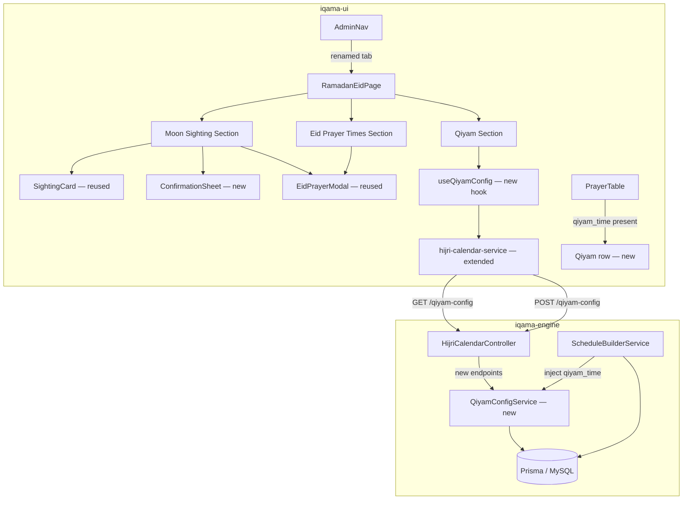

# Design Document — Ramadan & Eid Admin Redesign

## Overview

This feature delivers two related changes to the iqama system:

1. **Admin page redesign**: The existing `EidMoonSightingPage` at `/admin/eid` is replaced by a new `RamadanEidPage` with three clearly separated sections — Moon Sighting, Eid Prayer Times, and Qiyam al-Layl. The `AdminNav` tab label is renamed from "Eid & Moon Sighting" to "Ramadan & Eid". The Moon Sighting section gains a `ConfirmationSheet` bottom-sheet modal before any POST is dispatched. The Action Card is always visible (no longer gated by Hijri day). A new Qiyam al-Layl section lets the Imam configure a single start time for the last 10 nights of Ramadan.

2. **Qiyam al-Layl in the public prayer table**: During Hijri days 20–29 of month 9 (Ramadan), a "Qiyam" row appears in `PrayerTable` after Isha, showing the configured start time with no iqama column. The backend injects `qiyam_time` into `DailySchedule` following the same optional-field pattern as `eid_prayer_1`/`eid_prayer_2`. A new `QiyamConfig` Prisma model and two new API endpoints support this.

### Key Design Decisions

- **Separate `QiyamConfigService`**: Qiyam config logic is isolated in its own service rather than added to `CalendarOverrideService`, keeping each service focused on a single concern.
- **`ConfirmationSheet` as a generic component**: The bottom sheet is implemented as a reusable component that receives consequence text as a prop, keeping `RamadanEidPage` responsible for computing the consequence string.
- **No iqama for Qiyam**: The Qiyam row is display-only (start time only), consistent with the Eid prayer rows which also omit iqama.
- **Upsert semantics for QiyamConfig**: The service uses Prisma `upsert` keyed on `hijri_year`, matching the pattern already used by `CalendarOverrideService` for `CalendarOverride` and `SpecialPrayer`.
- **Schedule injection follows Eid pattern**: `qiyam_time` is injected via a spread in `buildMonth`, identical to how `eid_prayer_1`/`eid_prayer_2` are injected, minimising diff surface.

---

## Architecture

The feature spans both the frontend (React/TypeScript) and backend (NestJS/Prisma) layers.



### Data Flow — Qiyam Config Save

```
Imam taps "Save Qiyam time"
  → useQiyamConfig.save(time)
    → hijri-calendar-service.saveQiyamConfig(time)
      → POST /api/v1/hijri-calendar/qiyam-config { start_time }
        → HijriCalendarController.saveQiyamConfig()
          → QiyamConfigService.upsert(hijriYear, start_time)
            → prisma.qiyamConfig.upsert(...)
```

### Data Flow — Schedule Injection

```
GET /api/v1/schedule/:yearMonth
  → ScheduleBuilderService.buildMonth(yearMonth)
    → QiyamConfigService.getForYear(hijriYear)
      → prisma.qiyamConfig.findUnique(...)
    → for each day in month:
        if isQiyamNight(hijriDay, hijriMonth):
          schedule.qiyam_time = qiyamConfig.start_time
```

---

## Components and Interfaces

### Frontend — New Files

#### `iqama-ui/src/pages/RamadanEidPage.tsx`

Replaces `EidMoonSightingPage`. Orchestrates three sections. Manages the `ConfirmationSheet` open/close state and the pending decision (length + month) before the POST is dispatched.

```typescript
interface PendingDecision {
  length: 29 | 30;
  hijriMonth: number;
}
```

State:
- `confirmationSheetOpen: boolean`
- `pendingDecision: PendingDecision | null`
- `eidModalOpen: boolean`
- `editingEidType: EidType | null`

Flow:
1. User taps a decision button on `SightingCard` → `onDecision(length)` sets `pendingDecision` and opens `ConfirmationSheet`.
2. User taps "Confirm" on `ConfirmationSheet`:
   - If `hijriMonth === 9 || 11` → close sheet, open `EidPrayerModal`.
   - Otherwise → dispatch POST directly, show success/error.
3. User taps "Cancel" → close sheet, clear `pendingDecision`.

#### `iqama-ui/src/components/ConfirmationSheet.tsx`

A bottom-sheet modal that presents the consequence of a decision and requires explicit confirmation.

```typescript
interface ConfirmationSheetProps {
  /** Human-readable consequence text, e.g. "Eid al-Fitr will fall on Saturday, March 29, 2025" */
  consequenceText: string;
  onConfirm: () => void;
  onCancel: () => void;
}
```

Renders:
- Consequence text paragraph
- "Confirm" button (calls `onConfirm`)
- "Cancel" button (calls `onCancel`)
- Backdrop overlay (tapping backdrop calls `onCancel`)

#### `iqama-ui/src/hooks/useQiyamConfig.ts`

```typescript
interface UseQiyamConfigResult {
  config: { hijri_year: number; start_time: string } | null;
  loading: boolean;
  error: Error | null;
  save: (startTime: string) => Promise<void>;
  saving: boolean;
  saveError: string | null;
  saveSuccess: boolean;
}
```

Fetches on mount via `fetchQiyamConfig()`. Exposes `save()` which calls `saveQiyamConfig()` and updates local state.

### Frontend — Modified Files

#### `iqama-ui/src/components/AdminNav.tsx`

Change the third `NavLink` label from `"Eid & Moon Sighting"` to `"Ramadan & Eid"`. No other changes.

#### `iqama-ui/src/services/hijri-calendar-service.ts`

Add two new exported functions:

```typescript
export async function fetchQiyamConfig(): Promise<{ hijri_year: number; start_time: string } | null>

export async function saveQiyamConfig(startTime: string): Promise<void>
```

`fetchQiyamConfig` calls `GET /api/v1/hijri-calendar/qiyam-config` without auth. `saveQiyamConfig` calls `POST /api/v1/hijri-calendar/qiyam-config` with `requiresAuth: true`.

#### `iqama-ui/src/types/index.ts`

Add `qiyam_time?: string; // HH:mm` to the `DailySchedule` interface, following the `eid_prayer_1`/`eid_prayer_2` pattern.

#### `iqama-ui/src/components/PrayerTable.tsx`

In `DayRows`, after the Isha `PrayerRow`, add a conditional Qiyam row:

```tsx
{schedule.qiyam_time && (
  <PrayerRow
    name="isha"
    label="Qiyam"
    entry={{ azan: schedule.qiyam_time, iqama: '' }}
    isNext={false}
    isActive={false}
    isPast={false}
    isPeeked={false}
  />
)}
```

The `iqama: ''` value means the iqama column renders empty/hidden, consistent with Eid prayer rows.

### Backend — New Files

#### `iqama-engine/src/hijri-calendar/qiyam-config.service.ts`

```typescript
@Injectable()
export class QiyamConfigService {
  constructor(private readonly prisma: PrismaService) {}

  async getForYear(hijriYear: number): Promise<{ hijri_year: number; start_time: string } | null>

  async upsert(hijriYear: number, startTime: string): Promise<void>
}
```

`getForYear` calls `prisma.qiyamConfig.findUnique({ where: { hijri_year: hijriYear } })`.
`upsert` calls `prisma.qiyamConfig.upsert(...)` keyed on `hijri_year`.

#### `iqama-engine/src/hijri-calendar/dto/qiyam-config.dto.ts`

```typescript
export class QiyamConfigDto {
  @IsString()
  @Matches(/^([01]\d|2[0-3]):[0-5]\d$/, {
    message: 'start_time must be a valid HH:mm time (00:00–23:59)',
  })
  start_time: string;
}
```

The regex `^([01]\d|2[0-3]):[0-5]\d$` enforces valid 24-hour HH:mm format.

### Backend — Modified Files

#### `iqama-engine/src/hijri-calendar/hijri-calendar.controller.ts`

Add two new endpoints. Inject `QiyamConfigService` alongside `CalendarOverrideService`.

```typescript
@Get('qiyam-config')
async getQiyamConfig(): Promise<{ hijri_year: number; start_time: string } | null>

@Post('qiyam-config')
@UseGuards(ApiKeyGuard)
@HttpCode(HttpStatus.CREATED)
async saveQiyamConfig(@Body() dto: QiyamConfigDto): Promise<void>
```

`getQiyamConfig` resolves the current Hijri year via `dayjs().calendar('hijri').year()` and delegates to `QiyamConfigService.getForYear(hijriYear)`.

#### `iqama-engine/src/schedule-builder/schedule-builder.service.ts`

Inject `QiyamConfigService`. In `buildMonth`, before the per-day loop:

1. Determine the Hijri year for the month being built (use the first day of the month).
2. Fetch `QiyamConfigService.getForYear(hijriYear)` once per `buildMonth` call.
3. Inside the loop, check if the day is a Qiyam night:

```typescript
function isQiyamNight(date: Dayjs): boolean {
  const hijri = (date as any).calendar('hijri');
  const hMonth: number = (hijri.month() as number) + 1;
  const hDay: number = hijri.date() as number;
  return hMonth === 9 && hDay >= 20 && hDay <= 29;
}
```

4. Spread `qiyam_time` into the schedule object when applicable:

```typescript
...(qiyamConfig && isQiyamNight(dateDayjs) ? { qiyam_time: qiyamConfig.start_time } : {}),
```

#### `iqama-engine/src/schedule/daily-schedule.interface.ts`

Add `qiyam_time?: string; // HH:mm` after `eid_prayer_2`.

#### `iqama-engine/prisma/schema.prisma`

Add the `QiyamConfig` model:

```prisma
model QiyamConfig {
  id         Int      @id @default(autoincrement())
  hijri_year Int      @unique
  start_time String   // HH:mm
  createdAt  DateTime @default(now())
  updatedAt  DateTime @updatedAt
}
```

---

## Data Models

### QiyamConfig (Prisma / MySQL)

| Field       | Type     | Constraints              | Description                        |
|-------------|----------|--------------------------|------------------------------------|
| id          | Int      | PK, auto-increment       | Internal identifier                |
| hijri_year  | Int      | UNIQUE                   | Hijri year this config applies to  |
| start_time  | String   | HH:mm format             | Qiyam al-Layl start time           |
| createdAt   | DateTime | default now()            | Record creation timestamp          |
| updatedAt   | DateTime | @updatedAt               | Last update timestamp              |

The `@unique` constraint on `hijri_year` ensures at most one Qiyam config per year, enabling safe upsert semantics.

### QiyamConfig API Response Shape

```typescript
// GET /api/v1/hijri-calendar/qiyam-config
type QiyamConfigResponse = { hijri_year: number; start_time: string } | null;

// POST /api/v1/hijri-calendar/qiyam-config
interface QiyamConfigRequest {
  start_time: string; // HH:mm, validated by regex
}
```

### DailySchedule Extension

Both the backend interface (`iqama-engine/src/schedule/daily-schedule.interface.ts`) and the frontend type (`iqama-ui/src/types/index.ts`) gain:

```typescript
/** Qiyam al-Layl start time — present only on Hijri days 20–29 of month 9 */
qiyam_time?: string; // HH:mm
```

### Qiyam Night Determination

A date qualifies as a Qiyam night when:
- Hijri month = 9 (Ramadan)
- Hijri day ∈ {20, 21, 22, 23, 24, 25, 26, 27, 28, 29}

This covers the evenings of the last 10 nights (nights 21–30 of Ramadan). The check is performed using the `dayjs-hijri` plugin, consistent with the existing `isAstronomicalEidDay` helper in `schedule-builder.service.ts`.

---

## Correctness Properties

*A property is a characteristic or behavior that should hold true across all valid executions of a system — essentially, a formal statement about what the system should do. Properties serve as the bridge between human-readable specifications and machine-verifiable correctness guarantees.*

This feature uses [fast-check](https://fast-check.dev/) on the frontend (already a project dependency) and [fast-check](https://fast-check.dev/) via Jest/Vitest on the backend for property-based testing.

### Property 1: Qiyam config round-trip

*For any* valid HH:mm start time (00:00–23:59), saving it via `saveQiyamConfig(time)` and then fetching via `fetchQiyamConfig()` for the same Hijri year SHALL return the identical string value.

**Validates: Requirements 12.1**

### Property 2: Schedule injection preserves start_time exactly

*For any* valid HH:mm start time stored in `QiyamConfig`, `ScheduleBuilderService.buildMonth` SHALL inject the identical string value as `qiyam_time` on every date that falls on Hijri days 20–29 of month 9 of the current Hijri year.

**Validates: Requirements 9.1, 9.3, 12.2**

### Property 3: Qiyam row rendered iff qiyam_time present

*For any* `DailySchedule`, the `PrayerTable` SHALL render a "Qiyam" row after Isha if and only if `qiyam_time` is a non-empty string. When `qiyam_time` is absent or undefined, no Qiyam row SHALL appear.

**Validates: Requirements 10.1, 10.4**

### Property 4: Qiyam row displays the exact configured time

*For any* valid HH:mm `qiyam_time` value in a `DailySchedule`, the rendered Qiyam row in `PrayerTable` SHALL display that exact time string without modification.

**Validates: Requirements 10.2**

### Property 5: Action Card always visible for any Hijri day

*For any* Hijri day value (1–30), the `RamadanEidPage` SHALL render the Action Card regardless of the day value.

**Validates: Requirements 3.1**

### Property 6: Confirmation Sheet consequence text is correct for all months

*For any* Hijri month (1–12) and length (29 or 30), the `ConfirmationSheet` SHALL display a consequence text that: for months 9 and 11 includes a Gregorian Eid date; for all other months includes the resulting month length (29 or 30 days).

**Validates: Requirements 4.1**

### Property 7: Non-Eid months dispatch POST directly on confirm

*For any* Hijri month not in {9, 11}, tapping "Confirm" on the `ConfirmationSheet` SHALL dispatch the `POST /api/v1/hijri-calendar/override` request directly without opening `EidPrayerModal`.

**Validates: Requirements 4.5**

### Property 8: Invalid start_time values are rejected with HTTP 422

*For any* string that does not match the pattern `^([01]\d|2[0-3]):[0-5]\d$`, a `POST /api/v1/hijri-calendar/qiyam-config` request with that value as `start_time` SHALL return HTTP 422.

**Validates: Requirements 8.7**

### Property 9: QiyamConfig upsert — at most one record per Hijri year

*For any* valid start_time, calling `QiyamConfigService.upsert(hijriYear, time1)` followed by `QiyamConfigService.upsert(hijriYear, time2)` SHALL result in exactly one `QiyamConfig` record for that `hijri_year`, with `start_time` equal to `time2`.

**Validates: Requirements 7.3**

---

## Error Handling

### Frontend

| Scenario | Handling |
|---|---|
| `GET /hijri-calendar/status` fails | Display error message in Moon Sighting section; Action Card still renders |
| `POST /hijri-calendar/override` fails | Inline error message below the section; sheet remains closed |
| `GET /hijri-calendar/qiyam-config` fails | Inline error in Qiyam section; time input defaults to empty |
| `POST /hijri-calendar/qiyam-config` fails | Inline error in Qiyam section; `saveError` state set |
| `POST /hijri-calendar/qiyam-config` returns 422 | Error message includes the validation detail from the response body |

All async operations use try/catch with `err instanceof Error ? err.message : 'Operation failed'` fallback, consistent with existing hooks.

### Backend

| Scenario | Handling |
|---|---|
| `start_time` fails regex validation | `ValidationPipe` throws `UnprocessableEntityException` (HTTP 422) with field-level error details |
| `POST /qiyam-config` without API key | `ApiKeyGuard` returns HTTP 401 |
| Database error in `QiyamConfigService` | NestJS default exception filter returns HTTP 500 |
| `buildMonth` called when no `QiyamConfig` exists | `getForYear` returns `null`; no `qiyam_time` is injected (no error thrown) |

The existing `ValidationPipe` configuration in `HijriCalendarController` (with `exceptionFactory: (errors) => new UnprocessableEntityException(errors)`) already handles DTO validation errors uniformly, so the new `QiyamConfigDto` benefits from this automatically.

---

## Testing Strategy

### Unit Tests (Vitest — frontend, Jest — backend)

**Frontend:**
- `AdminNav.test.tsx`: Assert third tab label is "Ramadan & Eid"; assert active styling on `/admin/eid` route.
- `ConfirmationSheet.test.tsx`: Assert consequence text is rendered; assert Confirm/Cancel callbacks fire correctly; assert backdrop tap calls onCancel.
- `RamadanEidPage.test.tsx`: Assert Action Card always renders; assert ConfirmationSheet opens on button tap without dispatching POST; assert EidPrayerModal opens for months 9/11; assert POST dispatched directly for other months; assert success/error states.
- `useQiyamConfig.test.ts`: Assert fetch on mount; assert pre-population of time; assert save dispatches POST; assert error states.
- `hijri-calendar-service.test.ts`: Assert `fetchQiyamConfig` calls correct endpoint without auth; assert `saveQiyamConfig` calls correct endpoint with auth header; assert both throw on non-2xx.
- `PrayerTable.test.tsx`: Assert Qiyam row present when `qiyam_time` set; assert Qiyam row absent when `qiyam_time` absent; assert no iqama column in Qiyam row.

**Backend:**
- `qiyam-config.service.spec.ts`: Assert `getForYear` returns null when no record; assert `upsert` creates record; assert `upsert` updates existing record.
- `hijri-calendar.controller.spec.ts`: Assert GET returns 200 with correct shape; assert GET returns null when no config; assert POST returns 201; assert POST returns 422 for invalid `start_time`; assert POST returns 401 without API key.
- `schedule-builder.service.spec.ts`: Assert `qiyam_time` injected on days 20–29 of month 9; assert `qiyam_time` absent on day 19 and day 30 of month 9; assert `qiyam_time` absent on all days of non-Ramadan months; assert `qiyam_time` absent when no `QiyamConfig` exists.

### Property-Based Tests (fast-check)

**Frontend — `PrayerTable.pbt.test.tsx`:**

```typescript
// Feature: ramadan-eid-admin-redesign, Property 3: Qiyam row rendered iff qiyam_time present
// Feature: ramadan-eid-admin-redesign, Property 4: Qiyam row displays the exact configured time
it('renders Qiyam row iff qiyam_time is present and displays exact time', () => {
  fc.assert(fc.property(
    fc.option(fc.string({ minLength: 5, maxLength: 5 }).filter(isValidHHmm)),
    (qiyamTime) => {
      // render PrayerTable with schedule.qiyam_time = qiyamTime
      // assert: qiyamTime present → row exists with that text
      // assert: qiyamTime absent → no row
    }
  ), { numRuns: 100 });
});
```

**Frontend — `RamadanEidPage.pbt.test.tsx`:**

```typescript
// Feature: ramadan-eid-admin-redesign, Property 5: Action Card always visible for any Hijri day
it('Action Card always renders for any Hijri day', () => {
  fc.assert(fc.property(
    fc.integer({ min: 1, max: 30 }),
    (hijriDay) => {
      // render RamadanEidPage with status.hijriDay = hijriDay
      // assert: Action Card is present
    }
  ), { numRuns: 100 });
});

// Feature: ramadan-eid-admin-redesign, Property 6: Confirmation Sheet consequence text
it('ConfirmationSheet shows correct consequence for all months and lengths', () => {
  fc.assert(fc.property(
    fc.integer({ min: 1, max: 12 }),
    fc.constantFrom(29 as const, 30 as const),
    (hijriMonth, length) => {
      // render ConfirmationSheet with given month and length
      // assert: months 9/11 → contains Eid date string
      // assert: other months → contains length (29 or 30)
    }
  ), { numRuns: 100 });
});

// Feature: ramadan-eid-admin-redesign, Property 7: Non-Eid months dispatch POST directly
it('Non-Eid months dispatch POST directly on confirm', () => {
  fc.assert(fc.property(
    fc.integer({ min: 1, max: 12 }).filter(m => m !== 9 && m !== 11),
    fc.constantFrom(29 as const, 30 as const),
    (hijriMonth, length) => {
      // render RamadanEidPage with status.hijriMonth = hijriMonth
      // tap decision button, tap Confirm
      // assert: POST dispatched, EidPrayerModal not open
    }
  ), { numRuns: 100 });
});
```

**Backend — `qiyam-config.service.pbt.spec.ts`:**

```typescript
// Feature: ramadan-eid-admin-redesign, Property 9: Upsert — at most one record per Hijri year
it('upsert results in exactly one record with the latest start_time', async () => {
  await fc.assert(fc.asyncProperty(
    fc.integer({ min: 1400, max: 1500 }),
    validHHmmArbitrary,
    validHHmmArbitrary,
    async (hijriYear, time1, time2) => {
      await service.upsert(hijriYear, time1);
      await service.upsert(hijriYear, time2);
      const result = await service.getForYear(hijriYear);
      return result?.start_time === time2;
    }
  ), { numRuns: 100 });
});
```

**Backend — `schedule-builder.service.pbt.spec.ts`:**

```typescript
// Feature: ramadan-eid-admin-redesign, Property 2: Schedule injection preserves start_time exactly
it('injects exact start_time as qiyam_time on qualifying Ramadan nights', async () => {
  await fc.assert(fc.asyncProperty(
    validHHmmArbitrary,
    async (startTime) => {
      // mock QiyamConfigService.getForYear to return { start_time: startTime }
      // build schedule for a Ramadan month
      // assert: all days with hijriDay 20–29 of month 9 have qiyam_time === startTime
      // assert: all other days have no qiyam_time
    }
  ), { numRuns: 100 });
});
```

**Backend — `hijri-calendar.controller.pbt.spec.ts`:**

```typescript
// Feature: ramadan-eid-admin-redesign, Property 8: Invalid start_time rejected with 422
it('rejects any start_time not matching HH:mm pattern with 422', async () => {
  await fc.assert(fc.asyncProperty(
    fc.string().filter(s => !isValidHHmm(s)),
    async (invalidTime) => {
      const response = await request(app.getHttpServer())
        .post('/api/v1/hijri-calendar/qiyam-config')
        .set('x-api-key', validApiKey)
        .send({ start_time: invalidTime });
      return response.status === 422;
    }
  ), { numRuns: 100 });
});

// Feature: ramadan-eid-admin-redesign, Property 1: Qiyam config round-trip
it('POST then GET returns identical start_time', async () => {
  await fc.assert(fc.asyncProperty(
    validHHmmArbitrary,
    async (startTime) => {
      await request(app.getHttpServer())
        .post('/api/v1/hijri-calendar/qiyam-config')
        .set('x-api-key', validApiKey)
        .send({ start_time: startTime })
        .expect(201);
      const res = await request(app.getHttpServer())
        .get('/api/v1/hijri-calendar/qiyam-config')
        .expect(200);
      return res.body?.start_time === startTime;
    }
  ), { numRuns: 100 });
});
```

Each property test runs a minimum of 100 iterations. The `validHHmmArbitrary` helper generates strings matching `^([01]\d|2[0-3]):[0-5]\d$` using `fc.tuple(fc.integer({min:0,max:23}), fc.integer({min:0,max:59})).map(([h,m]) => ...)`.
